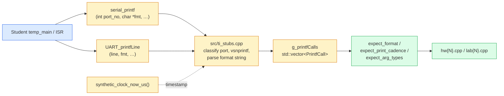

# Capture pipeline

Every `serial_printf` and `UART_printfLine` call the student firmware
makes is intercepted at the call site in `src/ti_stubs.cpp` and
recorded into a global vector of `PrintfCall` records. Checkers then
match those records against the spec's expected format string and
cadence.

This is the single most valuable piece of grader infrastructure: the
**most common student bug** is using `%d` for an `int32_t` (works on
the grader's 32-bit-int Linux host, breaks silently on the 16-bit-int
TI C2000 target). Rendered-output inspection cannot catch it; format
parsing can.



## What gets recorded

`PrintfCall` is defined in
[`include/checks/printf_capture.h`](https://github.com/Marius-Juston/AutomaticGrader/blob/master/include/checks/printf_capture.h):

```cpp
struct PrintfCall {
    SerialPort port = SerialPort::Unknown;
    std::string fmt;                  // raw format string
    ParsedFormat parsed;              // parsed specifier sequence
    std::string rendered;             // post-vsnprintf output
    uint64_t synthetic_timestamp_us;  // not wall clock
    std::size_t sequence_index;       // global ordering
    uint16_t lcd_line;                // UART_LCD only
};

extern std::vector<grader::PrintfCall> g_printfCalls;
```

`SerialPort` enumerates SCIA / SCIB / SCIC / SCID / UART_LCD plus an
`Unknown` fallback for unclassified ports.

## Synthetic clock — why no wall time?

`synthetic_clock_now_us()` returns a tick counter that the driver
advances by `period_us` on every ISR call. Cadence assertions compare
"how many SCIA prints in 1 s of synthetic time" — there is no wall
clock involved, so the assertion is **deterministic** regardless of
host load or build mode.

| API | Purpose |
|---|---|
| `grader::synthetic_clock_now_us()` | Current synthetic time. |
| `grader::synthetic_clock_reset()` | Zero the clock. Called by `resetPrintfCapture()`. |
| `grader::synthetic_clock_advance(us)` | Tick forward. Called internally by the driver and `run_isr_for_us`. |
| `grader::run_isr_for_us(isr, period, total_us)` | Convenience: advance + invoke `total_us / period_us` times. |

## How to use it in a check

```cpp
// 1. Reset the capture vector and synthetic clock.
grader::resetPrintfCapture();

// 2. Drive 1 s of synthetic time, interleaving one main-loop iteration
//    per ISR call. Single-threaded; the main-body branch that gates a
//    print on a counter will fire deterministically.
const uint64_t total_ticks = 1'000'000ull / period_us;
grader::drive_isr_with_main_pump(cpu_timer2_isr, period_us, total_ticks);

// 3. Cadence: expect 4 prints (every 250 ms) in that 1 s window, ±10%.
const bool cad_ok = grader::expect_print_cadence(
    grader::SerialPort::SCIA, 4, 0.10, "check_print_cadence");

// 4. Format: pull the latest SCIA call and match its format string.
const grader::PrintfCall *latest =
    grader::latestPrintfCall(grader::SerialPort::SCIA);
const bool fmt_ok = grader::expect_format(
    latest,
    "Timeint = %ld, Time = %.2f sec, Input = %.3f, SatOut = %.2f\r\n",
    "check_print_format");
```

This is verbatim from `src/checks/hw1.cpp:461-493` — the canonical
print-cadence + format check.

## Accessor API

From `printf_capture.h`:

| API | Returns |
|---|---|
| `grader::resetPrintfCapture()` | Clears the vector **and** resets the synthetic clock. Call at the top of every Phase 3 / Phase 4 block. |
| `grader::getPrintfCalls()` | Const ref to the underlying vector. |
| `grader::getPrintfCallsForPort(port)` | Vector of pointers to calls on that port. |
| `grader::latestPrintfCall(port)` | Pointer to most recent call on that port, or `nullptr`. |
| `grader::printfCallCount(port)` | Count for that port. |
| `grader::dumpPrintfCalls()` | Debug helper — logs every call to `spdlog`. |

## Format-string parser

`include/checks/format_parser.h` exposes a portable C printf parser:

- `grader::parse_format(fmt)` → `ParsedFormat{ specs, errors }`.
- `grader::FormatSpec{conversion, length_modifier, precision, width, flags}`.
- `grader::ArgType{Int16, Int32, UInt16, UInt32, Float, Double, String, Pointer, Char}`.
- `grader::format_specs_equivalent(a, b)` — tolerant compare: whitespace
  and static text differences ignored, but specifier-vs-required-type
  mismatches flagged.

The parser is what makes `expect_format` actually catch the
`%d`-for-`int32_t` bug instead of silently accepting whatever the host
renders.

## What's deferred (slice 1 scope)

These exist in the [roadmap](../contributing/validation-checklist.md)
but are **not yet implemented**:

- SCI RX simulation (`inject_serial_rx`) — checks that consume
  student-handled input.
- SPI TX-side word log (`spibTxLog`) — what the student *sent*.
- SWI post events.
- Camera-blob / OptiTrack injection.
- EPWM-triggered ADC SOC plumbing (separate from
  `inject_adc_result`).

Do not assume any of these are present when designing a new check.
