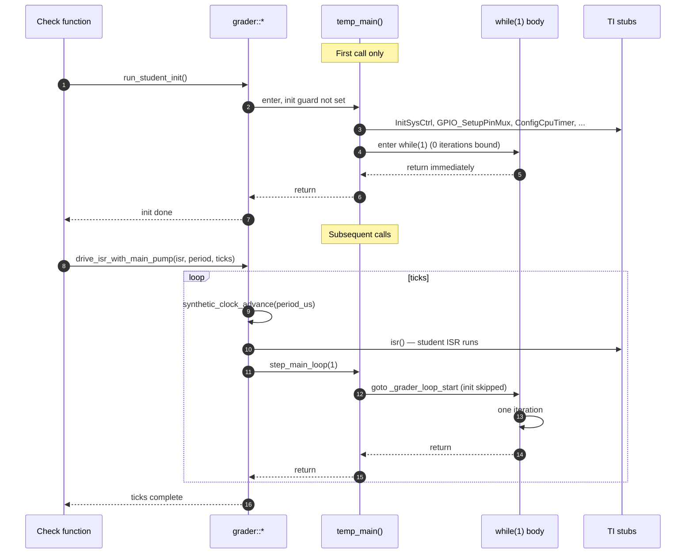

# Cooperative main-loop driver

The grader does **not** run the student's `temp_main` on a detached
thread. Instead, the student source is rewritten at build time so its
`while(1)` body becomes a function the harness can call one iteration
at a time. This eliminates the entire class of races that the previous
detached-thread design suffered (volatile-qualifier mismatches,
wall-clock sleeps, flaky "no SCIA prints captured" failures).

## The contract

`tools/patch_student_source.py` applies two transformations during the
build:

1. Inject a `GRADER_MAIN_INIT_GUARD` macro immediately after `main`'s
   opening `{`: a static flag plus `goto _grader_loop_start;` that
   skips all init code on every re-entry after the first one.
2. Replace `while (1)` with `_grader_loop_start: ; GRADER_MAIN_LOOP`,
   where `GRADER_MAIN_LOOP` expands to a `for`-loop bounded by
   `grader_main_loop_iterations()`.

Both macros are defined in `include/ti_stubs.h` under `AUTO_GRADER`.
The result lives at `${BUILD}/student_patched/student.c` — inspect it
when something looks wrong.



## Public API

The C++ surface lives in
[`include/checks/main_loop_driver.h`](https://github.com/Marius-Juston/AutomaticGrader/blob/master/include/checks/main_loop_driver.h):

| API | What it does |
|---|---|
| `grader::run_student_init()` | Calls `temp_main()` once with iterations = 0. Init runs, the patched loop body executes 0 times, main returns. `Validator::start_main_thread()` is a thin wrapper around this. |
| `grader::step_main_loop(n)` | Re-enters `temp_main()` with iterations = `n`. The init-guard goto skips init; only the body runs `n` times. |
| `grader::drive_isr_with_main_pump(isr, period_us, total_ticks)` | Lockstep driver: for `total_ticks` iterations, advance the synthetic clock, fire one ISR, then run one main-loop iteration. Use this for **every print / cadence check.** |
| `grader::reset_student_init()` | Test-only; forces the next `run_student_init()` to re-run init. |

## When to use which

- **ISR-internal state checks** (LED toggles between two register
  snapshots, accumulator counts): `grader::run_isr_for_us(isr, period, total_us)`
  is fine. No main-loop iteration needed.
- **Anything observed via a print** (cadence, format, or a flag set
  inside the `while(1)` body): **always** use
  `grader::drive_isr_with_main_pump(...)`. The previous code's
  `run_isr_for_us` + `std::this_thread::sleep_for` pattern only existed
  to mask races that no longer exist.
- **Tolerance ≤ ±10%** for cadence checks. The old slack of ±25–30%
  was masking those same races.

## Constraints the rewrite imposes on student code

- Exactly one `while (1)` (or any whitespace variant matching
  `while\s*\(\s*1\s*\)`) inside `main`. `for (;;)` and `while (true)`
  are *not* rewritten — extend `tools/patch_student_source.py` if a
  fixture needs them.
- Init code must be idempotent if a check legitimately needs to run
  init twice (we currently don't, but `reset_student_init()` is the
  escape hatch).
- Busy-waits in init are tolerated because the guard runs them only
  once. The HW3 reference busy-waits on `SpibRegs.SPIFFRX.bit.RXFFST`
  — for that case the HW3 checker spawns a `std::jthread` watchdog
  (`hw3_unblock_setup_spib`) that feeds the FIFO state register on
  first init.

## Common gotcha: snapshot + restore

Phase 3 of every check should snapshot any volatile globals it
mutates, then restore them before returning. Otherwise subsequent
checks in the same `checker()` list see polluted state. The HW1
checker's `take_snapshot()` / `restore_snapshot()` pattern is the
template:

```cpp
struct Hw1Phase3Snapshot {
    GPIO_DATA_REGS data{};
    uint16_t uart_print{0};
    uint32_t interrupt_count{0};
};

Hw1Phase3Snapshot take_snapshot() {
    return {GpioDataRegs, UARTPrint, CpuTimer2.InterruptCount};
}

void restore_snapshot(const Hw1Phase3Snapshot &s) {
    GpioDataRegs = s.data;
    UARTPrint = s.uart_print;
    CpuTimer2.InterruptCount = s.interrupt_count;
}
```

See [Common gotchas](../contributing/common-gotchas.md) for the full
list.
