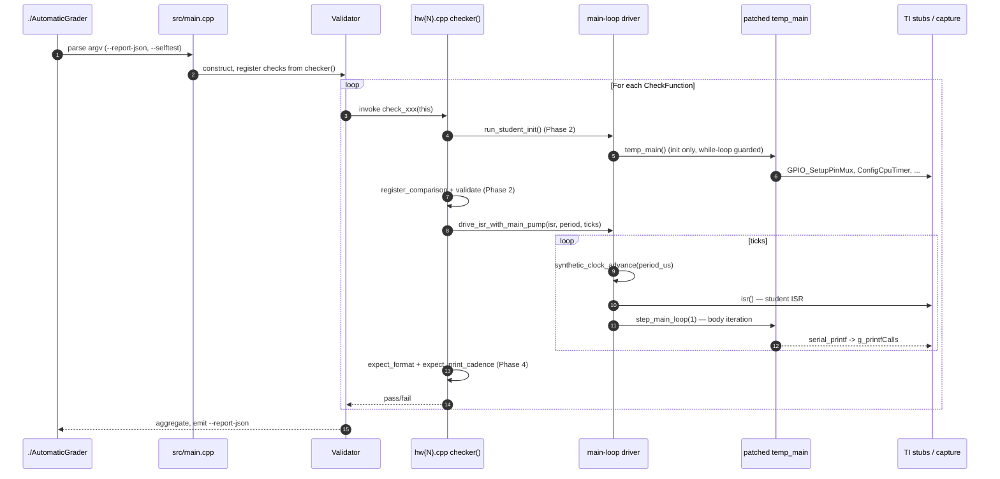

# Architecture overview

The grader is three layers — a hardware shim, a state-tracking core,
and a per-assignment harness — wrapped around the student's `main()`.
None of the student firmware is modified at the source level beyond a
mechanical `while(1)` rewrite; the rest is link-time and macro-level
substitution.

```mermaid
flowchart TB
    subgraph L1["Layer 1 — TI hardware shim"]
        direction TB
        Regs[Peripheral register structs<br/>GpioCtrlRegs, AdcaRegs, EPwm*Regs, ...]
        Stubs[src/ti_stubs.cpp<br/>GPIO_SetupPinMux, InitSysCtrl, serial_printf, ...]
        Headers[lib/C2000Ware_4_01_00_00/<br/>vendored TI headers]
        Macro[ti_stubs.h<br/>neutralizes __interrupt, EALLOW, ...]
    end

    subgraph L2["Layer 2 — State tracking"]
        direction TB
        Generated[generated.cpp<br/>compare_generated.cpp<br/>auto-generated overloads]
        Validator[HardwareStateValidator<br/>register_comparison / mark_as_used]
        ZeroPop[populate_all_zero()<br/>auto-generated]
    end

    subgraph L3["Layer 3 — Grading harness"]
        direction TB
        Main[src/main.cpp]
        ValOwner[Validator<br/>(owns the check list)]
        Checker[src/checks/hw{N}.cpp<br/>lab{N}.cpp]
        Driver[Cooperative<br/>main-loop driver]
        Capture[printf capture +<br/>synthetic clock]
    end

    Student[Patched student firmware<br/>temp_main]
    Student --> Stubs
    Stubs --> Regs
    Macro -.force-include.-> Student
    Macro -.force-include.-> Stubs
    Regs -.read by.-> Generated
    Generated --> Validator
    ZeroPop --> Validator
    Main --> ValOwner
    ValOwner --> Checker
    Checker --> Driver
    Checker --> Capture
    Driver --> Student
    Stubs --> Capture

    classDef shim fill:#dbeafe,stroke:#2563eb
    classDef state fill:#fef3c7,stroke:#d97706
    classDef harness fill:#dcfce7,stroke:#16a34a
    classDef external fill:#f3e8ff,stroke:#9333ea
    class Regs,Stubs,Headers,Macro shim
    class Generated,Validator,ZeroPop state
    class Main,ValOwner,Checker,Driver,Capture harness
    class Student external
```

## Layer 1 — TI hardware shim

The TI C2000 driverlib is replaced with plain-memory definitions of
every peripheral register struct (`GpioCtrlRegs`, `AdcaRegs`,
`EPwm1Regs`, …) plus capturing stubs for the functions the student
firmware calls. Student code links against these instead of the real
driverlib, so it runs as a normal Linux process.

| Concern | Where it lives |
|---|---|
| Vendored register definitions | `lib/C2000Ware_4_01_00_00/...` |
| Capturing function stubs | `src/ti_stubs.cpp` |
| TI-only-keyword neutralizer | `include/ti_stubs.h` (force-included via `-include ti_stubs.h`) |
| Stub-side capture for `serial_printf` | `src/ti_stubs.cpp` → `g_printfCalls` |

`ti_stubs.h` maps TI-only attributes/types to no-ops or standard types
(`Uint16` → `uint16_t`, `__interrupt` → empty, `EALLOW` /
`EDIS` → empty). It is force-included on every translation unit so
the student source compiles unmodified.

## Layer 2 — State tracking

Two halves:

- **Code-generated comparison overloads** for every TI register struct,
  emitted by the Python tools under `tools/`. The contract: for any
  register struct `T`, `check_zero(T &, name)` returns true iff every
  field is zero, and `check_compare(T &actual, T &expected, name)`
  returns true iff every field matches. Both write spec-quality
  `spdlog::warn` lines on mismatch.
- **`HardwareStateValidator`** (in `include/checks/state_checker.h`) —
  a map from register-name → lambda. Checkers register expectations
  through `register_comparison()` / `register_custom()` /
  `register_comparison_copy()`; `validate()` walks the map and returns
  the AND of every check.

`populate_all_zero()` is auto-generated and registers a zero-check for
every `extern volatile struct` declared in the TI headers. Phase 1 of
every checker calls it once to confirm the blank slate before init.

See [Build organisation](build-organisation.md) for how the generated
sources are split into a separate object library so a checker tweak
doesn't recompile them.

## Layer 3 — Grading harness

- **`Validator`** (`src/checks/validator.cpp`) owns the list of
  `CheckFunction`s for the active assignment. It also exposes
  `start_main_thread()` — historically the place where `temp_main` was
  launched on a `std::jthread`, **now a thin wrapper around
  `grader::run_student_init()`** (see
  [Cooperative driver](cooperative-driver.md)).
- **Per-assignment checker** (`src/checks/hw{N}.cpp` /
  `lab{N}.cpp`) defines `checker()` returning the list of check
  functions. It is the assignment-specific test suite, organised
  around the four-phase pattern
  ([details](../contributing/four-phase-pattern.md)).
- **Cooperative driver** drives the student's patched `temp_main()`
  body deterministically — no detached thread, no real-time sleeps.
- **Capture pipeline** (`g_printfCalls` + synthetic clock + expectation
  APIs) lets cadence/format checks run race-free.

## How a single grader run plays out



The diagram lifts the actual call order from `hw1.cpp` —
[four-phase pattern](../contributing/four-phase-pattern.md) walks
through it line by line.

## Where to read next

- [Cooperative main-loop driver](cooperative-driver.md) — why there's
  no detached thread and what that means for your check.
- [Capture pipeline](capture-pipeline.md) — how printf calls turn into
  format-and-cadence assertions.
- [Stimulus injection](stimulus-injection.md) — how to drive the
  peripherals the student code is supposed to react to.
- [Build organisation](build-organisation.md) — the five object
  libraries and how they cache.
