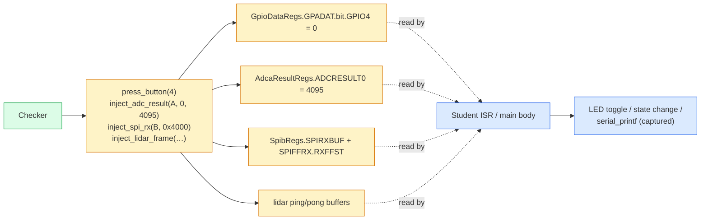

# Stimulus injection

Stimulus is the second half of every Phase-3 check. The student's code
reacts to inputs — buttons, ADC voltages, SPI reads, encoder counts,
lidar frames. The grader needs to drive those inputs deterministically
so the assertion "when PB1 is held, LED12 toggles" can be tested
against the spec.

All stimulus helpers live in
[`include/checks/stimulus.hpp`](https://github.com/Marius-Juston/AutomaticGrader/blob/master/include/checks/stimulus.hpp)
and operate by writing to the stub-side `*Regs` globals directly. The
student's polling code (e.g. `GpioDataRegs.GPADAT.bit.GPIO4`) then
observes the injected state on its next read.



## API surface

All in the `grader::` namespace.

### Buttons & generic GPIO inputs

| API | Effect |
|---|---|
| `press_button(int gpio_num)` | Writes `GPxDAT.bit.GPIO{n} = 0` (active-low). |
| `release_button(int gpio_num)` | Writes `GPxDAT.bit.GPIO{n} = 1`. |
| `button_state(int gpio_num)` | Reads the data register bit. |
| `set_gpio_input(int gpio_num, bool high)` | Generic single-bit GPIO drive. |
| `read_gpio_input(int gpio_num)` | Generic single-bit read. |

PB1..PB4 / joystick on the LaunchPad: GPIO4..GPIO8. The HW1 checker
uses `press_button(4)` for PB1, `press_button(7)` for PB4 (active-low,
so "press" means "drive line low").

### ADC results

```cpp
enum class AdcModule : uint8_t { A, B, C, D };

void inject_adc_result(AdcModule, int soc_idx, uint16_t value);
uint16_t read_adc_result(AdcModule, int soc_idx);
void clear_adc_results(AdcModule);
```

Writes the corresponding `Adc{a..d}ResultRegs.ADCRESULT{N}` slot.
Pair with an ISR that consumes the result to test ADC-scaling code.

### SPI RX

```cpp
enum class SpiModule : uint8_t { A, B, C };

void inject_spi_rx(SpiModule, uint16_t word);
void inject_spi_rx(SpiModule, std::span<const uint16_t>);
std::size_t spi_rx_fifo_size(SpiModule);
void clear_spi_state(SpiModule);
void clear_spi_state();  // all modules
```

Pushes a word (or sequence of words) into the SPI module's RX FIFO and
bumps `SPIFFRX.RXFFST`. Use for MPU-9250 / DAN28027 read patterns.

### Quadrature encoder

```cpp
enum class EqepModule : uint8_t { Eqep1, Eqep2, Eqep3 };

void inject_encoder_count(EqepModule, int32_t count);
int32_t read_encoder_count(EqepModule);
```

Writes `EQep{1,2,3}Regs.QPOSCNT`. Use for velocity / position checks.

### LIDAR frames

```cpp
constexpr int LIDAR_FRAME_LEN = 228;

void inject_lidar_ping(std::span<const float, LIDAR_FRAME_LEN>);
void inject_lidar_pong(std::span<const float, LIDAR_FRAME_LEN>);
void inject_lidar_frame(std::span<const float, LIDAR_FRAME_LEN>);  // both
void clear_lidar_frame();
```

228-element float arrays representing one full scan. `_frame` writes
both ping and pong so a ping-pong DMA consumer sees a coherent frame
either way.

### Teardown

```cpp
void reset_all_stimulus();
```

Clears every stimulus-side register. Call between sub-checks if you
don't want one check's pressed buttons to leak into the next.

## Patterns

### Pair every stimulus with an assertion

Stimulus is only useful when paired with the spec's expected response:

```cpp
// HW1 Exercise 9: when PB1 (GPIO4) is held, LED12 must toggle every 100 ms.
grader::release_button(4);  // primer
cpu_timer2_isr();
clear_all_toggle_regs();

grader::press_button(4);    // stimulus
for (size_t i = 0; i < ticks_per_100ms + 2; ++i) {
    cpu_timer2_isr();
}

success &= report(toggle_bit_set(GpioDataRegs.GPBTOGGLE.all, 61 - 32),
                  "PB1-pressed: GPIO61 (LED12) toggle bit not set",
                  "spec Ex.9: 'If PB1 (GPIO4) pressed, toggle LED12 (GPIO61)'");
```

### Prime, then stimulate

Many student implementations use an edge detector — `if (prev == 1
&& cur == 0)`. A naïve stimulus that simply asserts `press_button(4)`
before the ISR loop won't latch the edge because `prev` is still 0
from initialization. Fire one "released" ISR first to populate
`prev = 1`, then press and drive the window.

### Restore inputs to default before returning

`stimulus.hpp` provides `reset_all_stimulus()`, but a finer-grained
approach is to release each button you pressed at the end of the
check. That keeps cross-check pollution localized.

## Deferred stimulus (slice 1 scope)

The following helpers are **not yet implemented** — do not assume them:

- `inject_serial_rx(SerialPort, ...)` — for SCI RX-driven checks.
- `inject_blob(...)` — OpenMV camera blob frames (Lab7-2).
- `inject_optitrack(...)` — OptiTrack position frames (Lab7-2).
- SWI post helpers (`PostSWI*`).

See the [validation checklist](../contributing/validation-checklist.md)
for the full roadmap of what's planned.
