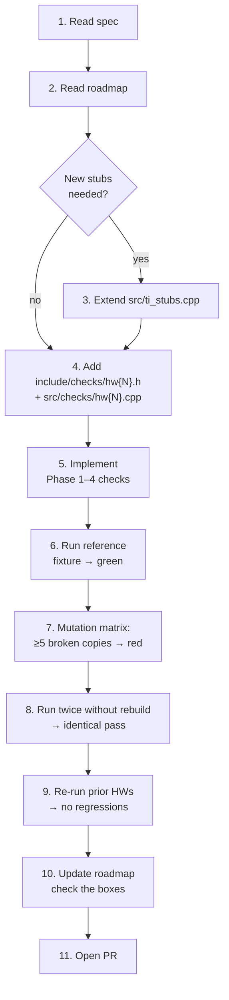

# Add a new checker

This page walks you from "I need to grade `Lab3`" to "the CI green tick
appears on a real PR" without skipping anything. Everything you write
should trace back to a quoted line in the spec — that's the
[authority rule](../index.md#authority-hierarchy).

The shipped reference for the pattern is
[`src/checks/hw1.cpp`](https://github.com/Marius-Juston/AutomaticGrader/blob/master/src/checks/hw1.cpp).
Use it as a working example any time the prose here is ambiguous.

## Workflow at a glance



## 1 — Read the spec

Pick the authoritative document for the assignment:

- `context/homeworks/HW{N}.tex` for homework.
- `context/lab/Lab{N}.txt` for labs.

Every assertion you write later must trace to a quoted sentence in this
file. If something is genuinely ambiguous, tag it `[ambiguous]` in the
roadmap and pick the most common interpretation — don't silently
guess.

## 2 — Read the roadmap

`progress/HW{N}_ROADMAP.md` / `progress/Lab{N}_ROADMAP.md` already has:

- a spec inventory table (which sentences map to which checks),
- the list of capturing stubs needed in `src/ti_stubs.cpp`,
- the validation matrix you'll be held to (mutation tests, snapshot
  hygiene, regression).

If the roadmap doesn't exist yet, write it first — it's faster to
build the check against an organized inventory than to discover gaps
mid-implementation.

## 3 — Extend stubs (if needed)

`src/ti_stubs.cpp` already covers most TI driverlib calls used by SE
423 (`GPIO_SetupPinMux`, `InitSysCtrl`, `ConfigCpuTimer`, ADC, EPWM,
SPI, EQEP, …). When the spec requires a new driverlib function, add
a stub mirroring the existing pattern at `src/ti_stubs.cpp:155`:

1. Read the register pointer the function targets (e.g.
   `GpioCtrlRegs.GPAMUX1.bit.GPIO0`).
2. Write the bitfield from the function's arguments.
3. Return.

That's it — no allocation, no logging, no I/O. The capturing stub
must be small enough that you can verify by inspection that it mirrors
the TI semantics.

For the **shared infrastructure** (printf capture, stimulus, synthetic
clock, expectations, cooperative driver), do **not** re-implement.
Consume the existing APIs:

- [`include/checks/printf_capture.h`](../architecture/capture-pipeline.md)
- [`include/checks/stimulus.hpp`](../architecture/stimulus-injection.md)
- [`include/checks/synthetic_clock.h`](../architecture/capture-pipeline.md#synthetic-clock-why-no-wall-time)
- [`include/checks/expectations.h`](using-expectations.md)
- [`include/checks/main_loop_driver.h`](../architecture/cooperative-driver.md)

## 4 — Create the checker files

Two files mirror `hw1.cpp` / `hw1.h`:

=== "include/checks/hw{N}.h"

    ```cpp
    #ifndef AUTOMATICGRADER_CHECKS_HW_N_H
    #define AUTOMATICGRADER_CHECKS_HW_N_H

    #include "checks/validator.h"

    int check_initialization(Validator *val);
    // ... one int check_<name>(Validator*) per assertion family
    CheckFunctions checker();

    #endif
    ```

=== "src/checks/hw{N}.cpp"

    ```cpp
    #include "checks/hwN.h"

    #include "checks/expectations.h"
    #include "checks/main_loop_driver.h"
    #include "checks/printf_capture.h"
    #include "checks/state_checker.h"
    #include "checks/stimulus.hpp"
    #include "checks/synthetic_clock.h"
    #include "checks/validator.h"

    int check_initialization(Validator *val) { ... }
    int check_<name>(Validator *)            { ... }

    CheckFunctions checker() {
        spdlog::info("Checking HW {}", N);
        return { &check_initialization, &check_<name>, ... };
    }
    ```

The build's `ASSIGNMENT=HW{N}` selector picks up
`src/checks/hw{N}.cpp` automatically — no CMake edit needed
([details](../reference/cmake-options.md)).

`Validator::start_main_thread()` is the public entry-point each check
uses to ensure the student's init code has run. Under the hood it
calls `grader::run_student_init()` — see
[Cooperative driver](../architecture/cooperative-driver.md).

## 5 — Implement Phase 1–4

The four-phase pattern is the contract:

1. **Phase 1** — Pre-main zero state.
2. **Phase 2** — Post-init register comparisons.
3. **Phase 3** — ISR-driven dynamics with stimuli.
4. **Phase 4** — Print cadence + format.

[Four-phase pattern](four-phase-pattern.md) walks the HW1 example line
by line and is the page to bookmark while you're writing checks.

## 6–9 — Validate

Walk every box in the
[Validation checklist](validation-checklist.md):

- The reference solution (`context/code_solutions/.../{HW,Lab}{N}/`)
  passes (or fails *only* on documented spec deviations).
- At least 5 hand-mutated copies of the reference each fail on the
  *exact* field that diverged. Mutation categories: numeric constants,
  structural (drop a line), format-string, cadence, stimulus reaction.
- Run twice without rebuilding → identical pass result (verifies
  Phase 3 snapshot/restore).
- Re-run prior HWs after adding any new stubs → no regressions.

## 10 — Update the roadmap

Check the boxes in `progress/HW{N}_ROADMAP.md` for the stubs you
added and the checks that now pass. The roadmap is part of the same
commit as the checker.

## 11 — Open the PR

The CI (`tests.yml`) runs:

- `ctest` over the C++ test suite.
- `./AutomaticGrader --selftest` against shared infrastructure.
- Python unit tests under `tests/python/`.

A green CI is the merge gate. If any of those go red, the PR doesn't
land — and that's the right behaviour: the autograder's primary job
is to be trustworthy.

## Common pitfalls

- **Skipping Phase 1** — the populate_all_zero check is what catches
  a stub that's silently writing during static init. Don't drop it.
- **Forgetting to snapshot/restore in Phase 3** — your check passes
  in isolation but contaminates the next one in the list. The Phase 3
  validation step ("run twice without rebuild → identical pass") is
  designed to surface this.
- **Loose tolerances** — anything ≥ ±25% in `expect_print_cadence`
  is a smell. The cooperative driver makes cadence deterministic;
  ±10% is the ceiling.
- **`%d` vs `%ld`** — `expect_format` will catch it, but only if you
  pass the **exact** spec string. Read the spec, paste it verbatim,
  then verify it parses by running once.

See [Common gotchas](common-gotchas.md) for the full list.
