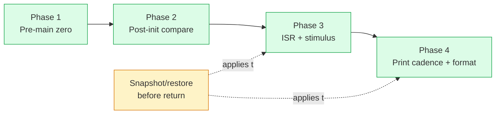

# Four-phase pattern

Every per-assignment checker is organised into four phases. The pattern
gives every check function the same skeleton, so a contributor can scan
a file and immediately know where to look for "the printf check" or
"the post-init register state".



This page walks `src/checks/hw1.cpp` phase by phase. Open the file
beside this page — line numbers below match it verbatim.

## Phase 1 — pre-main zero state

```cpp
int check_initialization(Validator *val) {
    HardwareStateValidator validator;
    validator.populate_all_zero();      // (1)

    int success = 1;
    success &= validator.validate();    // (2)

    val->start_main_thread();           // (3)
    // ... Phase 2 follows in the same check function ...
}
```

1. `populate_all_zero()` registers a zero-check for every TI register
   struct known to the auto-generated overloads. The registration is
   driven by `tools/hash_map_setter.py` and lives in
   `src/checks/stat_checker.cpp::HardwareStateValidator::populate_all_zero()`.
2. `validate()` returns true only if every register is still zeroed —
   catches stubs that silently write during static init.
3. `start_main_thread()` is a thin wrapper around
   `grader::run_student_init()` (see
   [Cooperative driver](../architecture/cooperative-driver.md)). It
   runs the student's init code with the `while(1)` body bound to
   zero iterations.

!!! tip
    Phase 1 is run once in the first check function (almost always
    `check_initialization`). Subsequent check functions don't need to
    repeat it — they can rely on the populate-all-zero invariant
    holding before init ran.

## Phase 2 — post-init register comparisons

After `start_main_thread()` returns, every peripheral the student's
init code touched has its register state set. Build `expected` structs
and register comparisons.

```cpp
// Excerpt from src/checks/hw1.cpp:42-80
{
    GpioSetup expected[MAX_GPIO];
    for (auto &i: expected) i = {};

    expected[31] = {GPIO_MUX_CPU1, 0, GPIO_OUTPUT, GPIO_PUSHPULL};
    // ...
    expected[4]  = {GPIO_MUX_CPU1, 0, GPIO_INPUT,  GPIO_PULLUP};

    validator.register_comparison("GpioSetup", gpiosSetup, expected);
}

{
    CPUTIMER_VARS expected = {};
    ConfigCpuTimer(&expected, LAUNCHPAD_CPU_FREQUENCY, 10000);
    validator.register_comparison("CpuTimer0", CpuTimer0, expected);
    // ...
}

success &= validator.validate();
```

**Which `register_*` variant to use:**

| API | When |
|---|---|
| `register_comparison(name, actual, expected)` | `actual` won't change before `validate()` (most common). |
| `register_comparison_copy(name, actual, expected)` | `actual` is mutated between registration and `validate()` (e.g. `GpioDataRegs` toggling between ISR ticks). Captures by value. |
| `register_custom(name, actual, expected, predicate)` | You need a custom predicate — `IER` bitmask comparison, or `UARTPrint` toggling. |
| `mark_as_used(name)` | Opt out of populate-all-zero for a register the student is *expected* to mutate. |

The full surface is in
[`include/checks/state_checker.h`](https://github.com/Marius-Juston/AutomaticGrader/blob/master/include/checks/state_checker.h).

### Authoring tip — regex for GPIO setup pairs

`src/ti_stubs.cpp` keeps a `gpiosSetup[MAX_GPIO]` array that mirrors
every `GPIO_SetupPinMux` / `GPIO_SetupPinOptions` pair the student
called. To lift those pairs out of a reference solution into your
`expected[]` array, run this regex in your editor:

=== "Find"

    ```regex
    GPIO_SetupPinMux\((\d+),(.+)\);\n+\s+GPIO_SetupPinOptions\(\d+,(.+)\);
    ```

=== "Replace"

    ```
    expected[$1] = {$2, $3};
    ```

## Phase 3 — ISR-driven dynamics + stimulus

The ISR runs on the actual target; on the grader, the checker invokes
it directly. To exercise an LED-toggle-when-button-held assertion,
press the button (= drive its `GPxDAT` bit low), drive the timer ISR
for the spec's specified window, assert the toggle bit is set, and
restore.

```cpp
// Skeleton lifted from src/checks/hw1.cpp:307-458
int check_timer2(Validator *) {
    const Hw1Phase3Snapshot baseline = take_snapshot();   // (1)

    auto run_window = [&](const char *label, bool press_pb1, bool press_pb4) {
        GpioDataRegs = baseline.data;
        CpuTimer2.InterruptCount = 0;
        UARTPrint = 0;
        clear_all_toggle_regs();

        grader::release_button(4);                        // (2) primer
        grader::release_button(7);
        cpu_timer2_isr();
        clear_all_toggle_regs();
        CpuTimer2.InterruptCount = 0;

        if (press_pb1) grader::press_button(4);
        else           grader::release_button(4);
        if (press_pb4) grader::press_button(7);
        else           grader::release_button(7);

        for (size_t i = 0; i < ticks_per_100ms + 2; ++i) { // (3)
            cpu_timer2_isr();
        }
    };

    run_window("PB1-pressed", true, false);

    // (4) Assert the spec-required LED toggles.
    success &= report(toggle_bit_set(GpioDataRegs.GPBTOGGLE.all, 61 - 32),
                      "PB1-pressed: GPIO61 (LED12) toggle bit not set",
                      "spec Ex.9: 'If PB1 (GPIO4) pressed, toggle LED12 (GPIO61)'");

    restore_snapshot(baseline);                            // (5)
    return success;
}
```

1. **Snapshot** — capture every volatile global the check will mutate.
2. **Primer** — fire one ISR with the buttons released. This latches
   `prev=1` in any edge-detector student code, so a subsequent press
   produces an actual edge.
3. **Drive** — invoke the ISR `ticks_per_100ms + 2` times. The `+ 2`
   ensures the 100 ms boundary is firmly inside the window even if
   `period_us` doesn't divide 100 000 µs evenly.
4. **Report** — `report()` is a per-check helper that emits a
   spec-quality log line on failure. The pattern: bool condition,
   short label, optional spec-quote hint.
5. **Restore** — every snapshot field, in reverse. Subsequent checks
   in the list must see the same pre-check state.

### Which driver to use

- **ISR-internal state** (toggle bit between two register snapshots):
  call the ISR directly in a `for` loop, as above. Or use
  `grader::run_isr_for_us(isr, period_us, total_us)` for a tick-count
  derived from synthetic time.
- **Anything observed via a print** (cadence or format), or any flag
  set in `main`'s `while(1)` body that gates a print: use
  `grader::drive_isr_with_main_pump(isr, period_us, total_ticks)`.
  This pairs each ISR call with exactly one main-loop iteration via
  the cooperative driver, so flag-gated prints fire deterministically.

## Phase 4 — print cadence + format

Reset the capture, drive the ISR/main pump for a known synthetic
window, then assert.

```cpp
// src/checks/hw1.cpp:461-493 (check_print_cadence)
int check_print_cadence(Validator *) {
    const Hw1Phase3Snapshot baseline = take_snapshot();
    const uint32_t period_us = static_cast<uint32_t>(CpuTimer2.PeriodInUSec);

    grader::release_button(4);
    grader::release_button(7);

    grader::resetPrintfCapture();        // (1)
    UARTPrint = 0;
    CpuTimer2.InterruptCount = 0;

    const uint64_t total_ticks = 1'000'000ull / period_us;
    grader::drive_isr_with_main_pump(cpu_timer2_isr, period_us, total_ticks);

    // Spec Ex.5: serial_printf must fire every 250 ms — 4 prints in 1 s.
    const bool ok = grader::expect_print_cadence(
        grader::SerialPort::SCIA, 4, 0.10, "check_print_cadence");      // (2)

    restore_snapshot(baseline);
    return ok ? 1 : 0;
}
```

1. `resetPrintfCapture()` clears `g_printfCalls` and resets the
   synthetic clock. **Call this before every Phase 3/4 driver loop.**
2. `expect_print_cadence(port, expected_count, tolerance_pct, name)` —
   tolerance ≤ ±10%.

Format check (HW1 Ex.8):

```cpp
const grader::PrintfCall *latest =
    grader::latestPrintfCall(grader::SerialPort::SCIA);

const bool ex8_ok = grader::expect_format(
    latest,
    "Timeint = %ld, Time = %.2f sec, Input = %.3f, SatOut = %.2f\r\n",
    "check_print_format[Ex.8]");

const bool args_ok = grader::expect_arg_types(
    latest,
    {grader::ArgType::Int32, grader::ArgType::Float,
     grader::ArgType::Float, grader::ArgType::Float},
    "check_print_format[Ex.8 arg types]");
```

The format parser tolerates whitespace and static-text differences but
flags any specifier-vs-required-type mismatch. `%d` for an `int32_t`
produces an explicit "TI C2000 16-bit int" warning in the error
message — the spec'd format string is the contract you give your
students.

## Why this skeleton, and not something else?

- **Phase 1 → 2 → 3 → 4** matches the order things happen on the
  device: power-on → init runs once → ISRs fire → printfs go out.
- **Snapshot/restore in Phase 3 and 4** is the discipline that lets
  multiple checks coexist in the same `checker()` list. Without it,
  check ordering becomes a hidden coupling.
- **Tolerance ≤ ±10%** is enforceable because the cooperative driver
  removed the race that the old code masked with ±25–30% slop.
