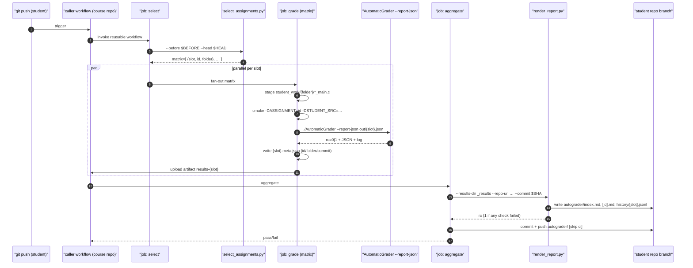
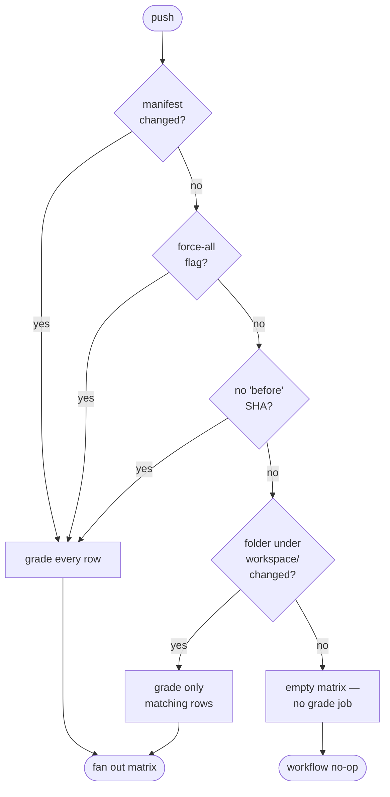

# Reusable workflow

The grader ships a **reusable GitHub Actions workflow** at
[`.github/workflows/grade.reusable.yml`](https://github.com/Marius-Juston/AutomaticGrader/blob/master/.github/workflows/grade.reusable.yml).
The outer course repo provides a thin caller workflow that points at
a tagged version of this one; on every student push, the caller
triggers a grading run.

## End-to-end flow



The three jobs:

1. **`select`** — runs `tools/select_assignments.py` over the diff
   between `before` and `head` SHAs. Outputs a matrix of `{slot, id,
   folder}` entries that need re-grading. Touched folders only, unless
   the manifest itself changed, or `force-all=true`, or it's the first
   push to a branch.
2. **`grade`** — matrix job, fans out one runner per slot. Configures
   CMake with `ASSIGNMENT=<id>` and `STUDENT_SRC=<staged path>`, builds,
   runs the grader, uploads `out/{slot}.json`, `out/{slot}.log`, and
   `out/{slot}.meta.json` as an artifact named `results-<slot>`.
3. **`aggregate`** — downloads every `results-*` artifact, runs
   `tools/render_report.py`, commits the rendered Markdown + JSON back
   to the student branch with `[skip ci]`. Fails the workflow if any
   graded check failed.

## Inputs

| Input | Default | Purpose |
|---|---|---|
| `manifest` | `workspace/assignment.txt` | Path inside the student repo to the manifest. |
| `workspace` | `workspace` | Folder containing per-assignment subfolders. |
| `report-dir` | `autograder` | Where rendered reports land in the student repo. |
| `grader-ref` | `master` | Tag/branch/SHA of AutomaticGrader to use. |
| `grader-repo` | `Marius-Juston/AutomaticGrader` | owner/repo of this grader. |
| `force-all` | `false` | Re-grade every manifest row regardless of which folders changed. |
| `commit-results` | `true` | Commit the rendered report back to the caller branch. |

## Minimal caller workflow

In the course base repo:

```yaml
# .github/workflows/grade.yml
name: Autograde

on:
  push:
    branches: [main, master]
    paths-ignore: ['autograder/**']
  workflow_dispatch:
    inputs:
      grade-all:
        description: Re-grade every manifest entry
        type: boolean
        default: false

permissions:
  contents: write

jobs:
  grade:
    uses: Marius-Juston/AutomaticGrader/.github/workflows/grade.reusable.yml@v1
    with:
      grader-ref: v1
      force-all: ${{ github.event.inputs.grade-all == 'true' }}
```

The `paths-ignore` exclusion is important: the aggregate job commits to
`autograder/`, and without the exclusion that commit would re-trigger
the workflow (`[skip ci]` is a courtesy, not a hard guarantee).

See [Course staff guide](../course-staff/instructor-guide.md) for the
full rollout: tagging, permissions, manual re-grading, troubleshooting.

## Self-test job

The repo's own `tests.yml` workflow covers three things on every push:

1. **`unit-tests`** — `ctest` over the C++ test suite under `tests/`.
2. **`selftest`** — `./AutomaticGrader --selftest` exercises the
   shared slice-1 infrastructure end-to-end.
3. **`python-tools`** — matrix across Python 3.12 and 3.13: runs
   `select_assignments.py --self-test`, lints both workflow YAMLs, and
   executes the Python unit tests under `tests/python/`.

If you touch anything under `tools/`, `tests/python/` is where to add
coverage.

## What gets graded vs skipped



Selecting only the changed assignments keeps the typical CI time at
roughly 30–90 s. A full re-grade runs in *N × ~60 s* (matrix is
parallel up to GitHub's default of 256 jobs).

## Where to read next

- [Manifest & slots](manifest-and-slots.md) — how rows become matrix
  entries, what duplicate IDs mean.
- [Reports & traceability](reports.md) — what the rendered report
  contains and how the commit-link wiring works.
