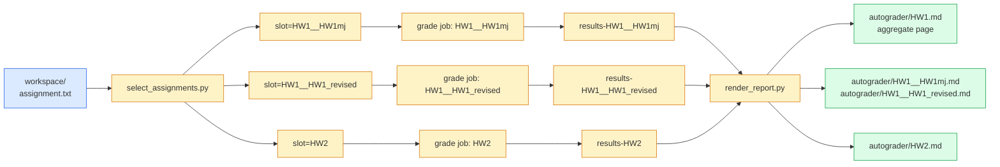

# Manifest & slots

The manifest at `workspace/assignment.txt` is the single source of
truth for which folders contain which assignments. Each line is one
graded submission:

```
HW1  HW1mj
HW2  HW2mj           # explicit folder only
HW3  HW3mj  HW3_main.c   # 3rd column = explicit main file (disambiguates)
Lab5 Lab5
```

- **Column 1** — assignment ID (`HW1`..`HW6`, `Lab1`..`Lab6`,
  `Lab7-1`, `Lab7-2`).
- **Column 2** — folder relative to `workspace/`.
- **Column 3** (optional) — explicit `*_main.c` to compile when the
  folder contains more than one.

Blank lines and `#` comments are ignored.

## Duplicate IDs

Duplicate IDs are allowed — useful when a student submits multiple
attempts, or when course staff want to A/B grade two versions of the
same homework:

```
HW1 HW1mj
HW1 HW1_revised
HW2 HW2mj
```

Both `HW1` rows run as independent matrix jobs and the rendered report
aggregates them. `tools/select_assignments.py` assigns a unique **slot**
per row so artifact names, JSON filenames, and history files don't
collide:

| Manifest state | Slot for `HW1` rows |
|---|---|
| Single `HW1` row | `HW1` |
| Two `HW1` rows | `HW1__HW1mj` and `HW1__HW1_revised` |
| Folder names slug-collide | `HW1__<slug>` and `HW1__<slug>__2` (disambiguating suffix) |

The slug is the folder name with non-alphanumerics replaced by `-` and
trimmed. The slot is the matrix-job identity used everywhere downstream:



## Meta sidecar — what makes results traceable

Each grade job writes a `<slot>.meta.json` next to the result JSON,
recording the exact `(id, folder, slot, commit)` it ran against. The
renderer uses this to build hyperlinks back to the source tree at the
commit it was graded against.

```json
{
  "slot": "HW1__HW1mj",
  "id": "HW1",
  "folder": "HW1mj",
  "commit": "cafef00d1234567890..."
}
```

This is the **traceability contract**: every row of the rendered report
links to the exact commit + folder pair that produced it. Even after
the next push moves the branch forward, prior rows in the aggregate
still point at the commit they were graded against — partial regrades
don't clobber sibling rows.

See [Reports & traceability](reports.md) for what that looks like in
the rendered output.

## Why slot != id

Before duplicates were supported, every artifact was named after the
assignment ID and `out/HW1.json` was unique. Duplicates would collide:
two `HW1` matrix legs would overwrite each other's artifact. The slot
introduces a unique key while keeping single-row manifests
unchanged — when the ID is unique, `slot == id`, so old single-row
deployments need no migration.

## Selection rules

Given a push from `before` SHA to `head` SHA:

1. If `before` is missing (first push to a branch): grade every row.
2. If `--force-all` is passed: grade every row.
3. If the manifest itself was touched: grade every row.
4. Otherwise: grade only the rows whose `workspace/<folder>/` was
   touched.

The selector is intentionally permissive on (4) — a path under
`workspace/<folder>/` modified by a merge or rebase still triggers a
grade. Better to over-grade than miss a regression.

## Authoritative spec

The authoritative description of manifest parsing, slot derivation, and
selection lives in the module docstrings of
[`tools/select_assignments.py`](../reference/python-tools.md#select_assignments)
— that's what `mkdocstrings` renders into the Python tools page.
